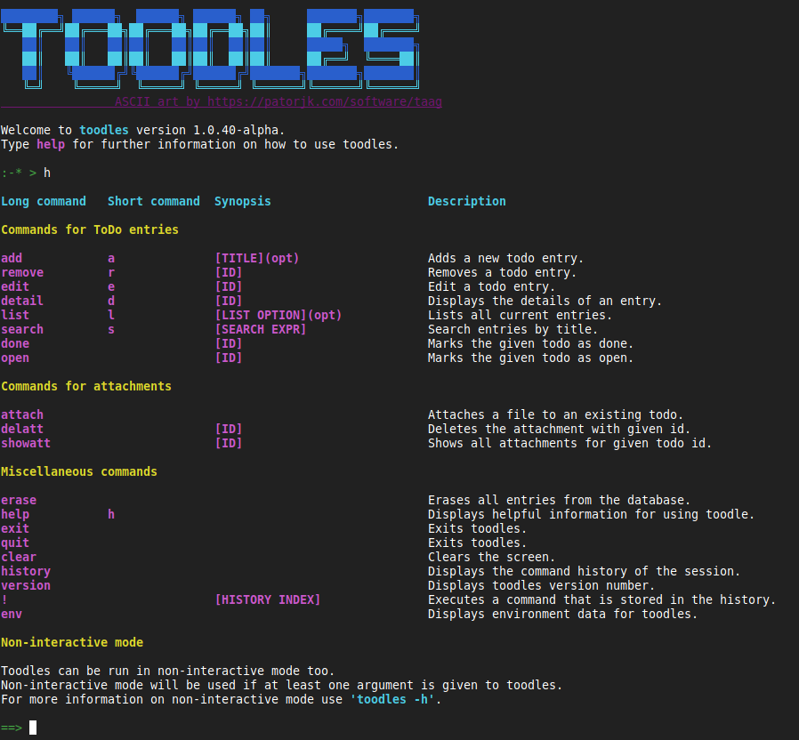

# &#129412; toodles &#129412;

Just another ToDo application. Or is it?...

No, seriously, it's just another ToDo application. For your awesome Linux CLI.

## What can toodles do?

Well... tons of stuff. If it's tiny tons.



You can add ToDos, remove ToDos, edit them, attach files to them etc.

## I need it! What do I do?

### Requirements

&#129412; libsqlite3    
&#129412; cmake     
&#129412; pkg-config

### Building and Installation

Just clone the repository and use `cmake` for building the application.

```
mkdir -p build && cd build && cmake -DCMAKE_BUILD_TYPE=Release .. && make
```

For installing you can use `make` after building.

```
sudo make install
```

### Interactive mode

When you start `toodles` without any arguments the prompt will show up.
From there you can start using `toodles` as described in the application help. For showing the application help, just type `help` or `h`.

### Non-interactive mode

Non-interactive mode is invoked if `toodles` is started with arguments.
In non-interactive mode `toodles` behaves... non-interactive... no prompt whatsoever. But you can use `toodles` for scripting. If you want that.

```
./toodles -c add -t "New important task!"
```
For help on using `toodles` in non-interactive mode pass `-h` as argument.

### Environment

You can use the `env` command in interactive mode to get a detailed overview of what files and directories `toodles` is using.